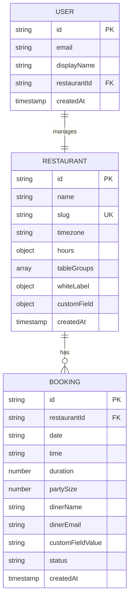
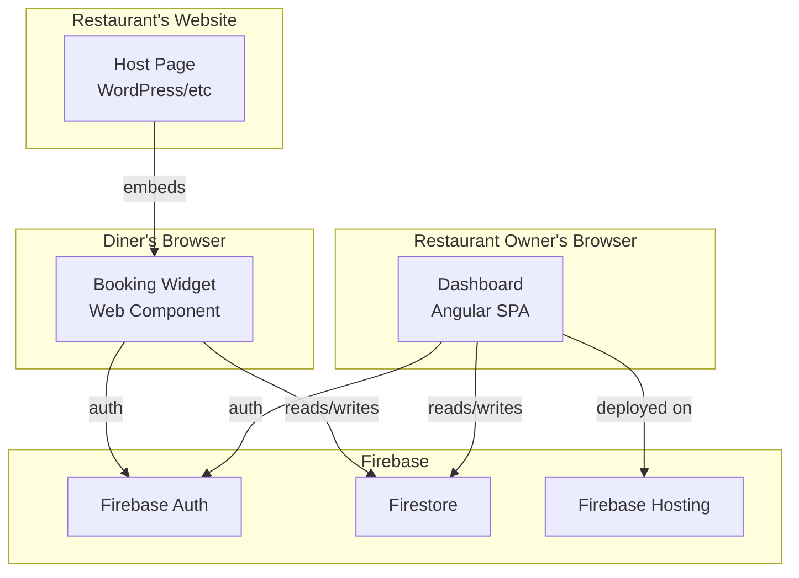

# Architecture Spine — osefdetalife-booking

## Design Paradigm

**Serverless-event-driven** on Firebase. No servers to manage, no infrastructure to provision. The widget and dashboard are static assets; all logic runs in the browser or in Firestore Security Rules. The system scales automatically with Firebase.

**Layers:**

- **Presentation:** Web Component (widget) + Angular SPA (dashboard)
- **Data:** Firestore (NoSQL document database)
- **Auth:** Firebase Auth (email/password + Google OAuth)
- **Deployment:** Firebase Hosting (dashboard) + CDN (widget script)

## Invariants & Rules

### AD-1 — Widget Deployment via Script Tag

- **Binds:** widget, deployment
- **Prevents:** npm package or iframe approaches
- **Rule:** Widget renders as a custom element (`<booking-widget>`) on any website. Restaurant adds `<script src="...">` and `<booking-widget restaurant="slug"></booking-widget>` to their page.

### AD-2 — Direct Firebase from Browser

- **Binds:** all data access (widget + dashboard)
- **Prevents:** API layer overhead, server-side complexity
- **Rule:** Widget and dashboard use Firebase client SDK directly. Firestore Security Rules enforce access control. No Cloud Functions for MVP.
- **Security rules:** Unauthenticated writes scoped to `create` only on `bookings`. Rules must validate that `restaurantId` in booking writes references an existing restaurant document. Widget and dashboard rule sets must be authored together, not independently.

### AD-3 — Firebase Auth with Email/Password + Google Sign-In

- **Binds:** restaurant owner authentication
- **Prevents:** passwordless or other auth providers
- **Rule:** Dashboard auth uses Firebase Auth. Supports email/password and Google OAuth. Restaurant owner profile stored in Firestore.

### AD-4 — Web Components with Shadow DOM for Widget

- **Binds:** widget rendering
- **Prevents:** style conflicts with host page
- **Rule:** Widget renders as custom element with Shadow DOM isolation. Host page CSS cannot affect widget styling. Widget CSS cannot affect host page.

### AD-5 — Compute on Read for Availability

- **Binds:** booking availability logic
- **Prevents:** pre-computed slot storage
- **Rule:** Availability calculated by querying all bookings for a date, subtracting from table groups. 15-minute time slots generated dynamically.
- **Duration:** Each booking occupies its table for a restaurant-configurable duration (default 2 hours). The `duration` field (in minutes) is stored on the BOOKING document.
- **Timezone:** All dates and times are in the restaurant's configured IANA timezone (stored on the RESTAURANT document as `timezone: string`). The widget converts the diner's local time to the restaurant's timezone before querying.

### AD-6 — No Table Splitting

- **Binds:** availability calculation
- **Prevents:** multi-table party accommodation
- **Rule:** Party of N requires a single table of capacity ≥ N. No merging tables.

### AD-7 — Auto-Confirm Bookings

- **Binds:** booking status model
- **Prevents:** pending/confirmation flow
- **Rule:** Bookings confirmed on submission. Status set to "confirmed" immediately. Confirmation step deferred to next iteration.

### AD-8 — Diner Info: Name + Email + Custom Field

- **Binds:** booking form
- **Prevents:** anonymous bookings
- **Rule:** Diner name and email required. Custom field optional with restaurant-defined label.

### AD-9 — Restaurant Slug for Identification

- **Binds:** widget deployment
- **Prevents:** UUID-based identification
- **Rule:** Each restaurant has a unique slug. Used in widget embed: `<booking-widget restaurant="the-blue-bistro">`.
- **Lookup:** Slug resolution uses a collection query on the `slug` field, not the document ID. Firestore rules enforce slug uniqueness via a `slugs/{slug}` lookup document.

### AD-10 — Widget Flow: Party Size → Times → Date → Details → Confirmation

- **Binds:** widget UX
- **Prevents:** date-first flow
- **Rule:** Diner selects party size first, then sees available times for that party size. Calendar shows all operating dates.

### AD-11 — Dashboard: Today's Bookings + Date Picker

- **Binds:** dashboard UX
- **Prevents:** all-bookings view
- **Rule:** Default to today's bookings. Date picker to navigate to other dates.

### AD-12 — Booking Actions in Model, Not in UI

- **Binds:** booking status model
- **Prevents:** premature UI complexity
- **Rule:** Status field supports "confirmed" and "cancelled". UI is read-only for MVP. Actions (confirm, cancel) added in next iteration.

### AD-13 — One Restaurant per Account

- **Binds:** account model
- **Prevents:** multi-location complexity
- **Rule:** Single restaurant per auth account. Multi-location deferred to next version.

## Consistency Conventions

| Concern | Convention |
| --- | --- |
| Entity IDs | Firestore auto-generated IDs (no custom slugs for documents) |
| Restaurant slug | Lowercase, hyphenated, unique (e.g., `the-blue-bistro`) |
| Date format | ISO 8601 (`YYYY-MM-DD`) for storage, locale-formatted for display |
| Time format | 24-hour (`HH:mm`) for storage, 12-hour for display |
| Timestamps | Firestore server timestamps |
| Status values | Lowercase strings: `confirmed`, `cancelled` |
| Error handling | User-facing toasts for transient errors; console logging for debug |
| Table groups shape | `Array<{capacity: number, count: number}>` — capacity = seats at one table, count = number of tables with that capacity |
| Hours shape | `Record<number, {open: string, close: string}>` — keys are ISO day numbers (1=Monday, 7=Sunday), time values in 24-hour HH:mm |
| Timezone | IANA timezone string stored on RESTAURANT document (e.g., `Europe/London`). All date/time operations use restaurant's timezone. |

## Stack

| Name | Version | Purpose |
| --- | --- | --- |
| Angular | 22+ | Dashboard SPA |
| Firebase Hosting | — | Dashboard deployment |
| Firestore | — | Primary database |
| Firebase Auth | — | Authentication |
| Web Components | v1 | Widget rendering (Custom Elements + Shadow DOM) |
| TypeScript | 7.x | Language for both widget and dashboard |
| Vite | — | Widget build tool (lightweight, fast) |

## Structural Seed

```text
src/
  widget/                    # Embeddable booking widget (Web Component)
    booking-widget.ts        # Custom element definition
    components/              # Widget UI components
    styles/                  # Shadow DOM styles
    firebase.ts              # Firebase client config for widget
  dashboard/                 # Restaurant management dashboard (Angular)
    app/
      components/            # Angular components
      services/              # Angular services
      pages/                 # Route-level components
    environments/            # Firebase config per env
  shared/                    # Shared types and utilities
    types/                   # TypeScript interfaces
    firebase-config.ts       # Shared Firebase initialization
```

## Data Model (Firestore)



## System Diagram



## Capability → Architecture Map

| Capability | Lives in | Governed by |
| --- | --- | --- |
| Diner booking flow | widget/ | AD-1, AD-4, AD-10 |
| Availability calculation | widget/ + Firestore | AD-5, AD-6 |
| Restaurant settings | dashboard/ | AD-3, AD-13 |
| Booking list | dashboard/ | AD-11, AD-12 |
| Auth (restaurant owner) | Firebase Auth + dashboard/ | AD-3 |
| Data storage | Firestore | AD-2, AD-8, AD-9 |

## Deferred

- **Confirmation step** — Deferred to next iteration. Model supports it (status field), UI doesn't expose it yet.
- **Multi-location** — One restaurant per account for MVP. Data model supports it (restaurantId on booking), UI doesn't.
- **Email/SMS confirmations** — Deferred. Diner email collected, not used yet.
- **POS integration** — Deferred to post-MVP.
- **Google Reserve** — Deferred to post-MVP.
- **AI features** — Deferred to post-MVP.
- **Deployment & environments** — Deferred. For MVP, single Firebase project.
