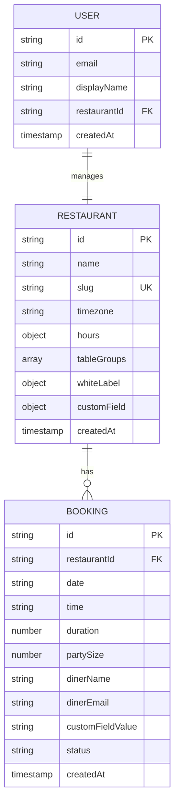

# Architecture Spine — osefdetalife-booking

## Design Paradigm

**Serverless-event-driven** on Firebase. No servers to manage, no infrastructure to provision. The booking page and dashboard are part of a single Angular app; all logic runs in the browser or in Firestore Security Rules. The system scales automatically with Firebase.

**Layers:**

- **Presentation:** Angular SPA (public booking page + dashboard)
- **Data:** Firestore (NoSQL document database)
- **Auth:** Firebase Auth (email/password + Google OAuth)
- **Deployment:** Firebase Hosting (single app: booking page + dashboard)

## Invariants & Rules

### AD-1 — Public Booking Route

- **Binds:** booking-page, deployment
- **Prevents:** npm package or iframe approaches
- **Rule:** The public booking page renders at `/book/{slug}` within the Angular app. Restaurants share the booking link (and QR code) with diners; no embedding of code is required.

### AD-2 — Direct Firebase from Browser

- **Binds:** all data access (booking page + dashboard)
- **Prevents:** API layer overhead, server-side complexity
- **Rule:** Booking page and dashboard use Firebase client SDK directly. Firestore Security Rules enforce access control. No Cloud Functions for MVP.
- **Security rules:** Unauthenticated writes scoped to `create` only on `bookings`. Rules must validate that `restaurantId` in booking writes references an existing restaurant document. Booking page and dashboard rule sets must be authored together, not independently.

### AD-3 — Firebase Auth with Email/Password + Google Sign-In

- **Binds:** restaurant owner authentication
- **Prevents:** passwordless or other auth providers
- **Rule:** Dashboard auth uses Firebase Auth. Supports email/password and Google OAuth. Restaurant owner profile stored in Firestore.

> **AD-4 (Web Components with Shadow DOM for Widget)** — removed by the 2026-08-14 public-booking-page pivot. White-label theming of the booking page via CSS custom properties is still required (UX-DR1, Story 2.1).

### AD-5 — Compute on Read for Availability

- **Binds:** booking availability logic
- **Prevents:** pre-computed slot storage
- **Rule:** Availability calculated by querying all bookings for a date, subtracting from table groups. 15-minute time slots generated dynamically.
- **Duration:** Each booking occupies its table for a restaurant-configurable duration (default 2 hours). The `duration` field (in minutes) is stored on the BOOKING document.
- **Timezone:** All dates and times are in the restaurant's configured IANA timezone (stored on the RESTAURANT document as `timezone: string`). The booking page converts the diner's local time to the restaurant's timezone before querying.

### AD-6 — No Table Splitting

- **Binds:** availability calculation
- **Prevents:** multi-table party accommodation
- **Rule:** Party of N requires a single table of capacity ≥ N. No merging tables.

### AD-7 — Auto-Confirm Bookings

- **Binds:** booking status model
- **Prevents:** pending/confirmation flow
- **Rule:** Bookings confirmed on submission. Status set to "confirmed" immediately. Confirmation step deferred to next iteration.

### AD-8 — Diner Info: Name + Email + Custom Field

- **Binds:** booking form
- **Prevents:** anonymous bookings
- **Rule:** Diner name and email required. Custom field optional with restaurant-defined label.

### AD-9 — Restaurant Slug for Identification

- **Binds:** booking page route
- **Prevents:** UUID-based identification
- **Rule:** Each restaurant has a unique slug. Used in the public booking page route: `/book/{slug}`.
- **Lookup:** Slug resolution uses a collection query on the `slug` field, not the document ID. Firestore rules enforce slug uniqueness via a `slugs/{slug}` lookup document.

### AD-10 — Booking Flow: Party Size → Date → Times → Details → Confirmation

- **Binds:** booking page UX
- **Prevents:** date-first flow
- **Rule:** Diner selects party size first, then picks a date, then sees available times for that party size. Calendar shows all operating dates.

### AD-11 — Dashboard: Today's Bookings + Date Picker

- **Binds:** dashboard UX
- **Prevents:** all-bookings view
- **Rule:** Default to today's bookings. Date picker to navigate to other dates.

### AD-12 — Booking Actions in Model, Not in UI

- **Binds:** booking status model
- **Prevents:** premature UI complexity
- **Rule:** Status field supports "confirmed" and "cancelled". UI is read-only for MVP. Actions (confirm, cancel) added in next iteration.

### AD-13 — One Restaurant per Account

- **Binds:** account model
- **Prevents:** multi-location complexity
- **Rule:** Single restaurant per auth account. Multi-location deferred to next version.

### AD-14 — Public Booking Availability Read (public projection)

- **Binds:** booking availability calculation, security rules, booking data model
- **Prevents:** owner-only booking reads blocking the public booking page's availability calc
- **Rule:** Availability reads happen against a public projection subcollection `restaurants/{restaurantId}/bookings-public/{bookingId}`, written in the same batch as the full booking. The projection stores only non-PII fields — `date`, `time`, `partySize`, `status` — and is publicly readable (`allow read: if true`). Full bookings remain owner-only-read and hold diner PII (`name`, `email`, `customFieldValue`). Rules reject PII fields on the projection (`!('name' in data) && !('email' in data) && !('customFieldValue' in data)`). Owner cancellation updates both documents.
- **Security:** Low-medium risk — the public surface contains no diner PII, so unauthenticated reads of `bookings-public` expose only availability data. Cross-restaurant enumeration is limited to date/time/partySize metadata. Firestore rules cannot validate query filters, so "filter-only reads" are enforced structurally (PII simply never lives on the readable document) instead of via rules.

## Consistency Conventions

| Concern | Convention |
| --- | --- |
| Entity IDs | Firestore auto-generated IDs (no custom slugs for documents) |
| Restaurant slug | Lowercase, hyphenated, unique (e.g., `the-blue-bistro`) |
| Date format | ISO 8601 (`YYYY-MM-DD`) for storage, locale-formatted for display |
| Time format | 24-hour (`HH:mm`) for storage, 12-hour for display |
| Timestamps | Firestore server timestamps |
| Status values | Lowercase strings: `confirmed`, `cancelled` |
| Error handling | User-facing toasts for transient errors; console logging for debug |
| Table groups shape | `Array<{capacity: number, count: number}>` — capacity = seats at one table, count = number of tables with that capacity |
| Hours shape | `Record<number, {open: string, close: string}>` — keys are ISO day numbers (1=Monday, 7=Sunday), time values in 24-hour HH:mm |
| Timezone | IANA timezone string stored on RESTAURANT document (e.g., `Europe/London`). All date/time operations use restaurant's timezone. |

## Stack

| Name | Version | Purpose |
| --- | --- | --- |
| Angular | 22+ | App (public booking page + dashboard) |
| Firebase Hosting | — | App deployment |
| Firestore | — | Primary database |
| Firebase Auth | — | Authentication |
| TypeScript | 7.x | Language for the single Angular app |

## Structural Seed

```text
src/
  booking/                   # Public booking page (unauthenticated; /book/{slug})
    components/
    services/
    pages/
  dashboard/                 # Restaurant management dashboard (authenticated)
    components/
    services/
    pages/
  environments/              # Firebase config per env
  shared/                    # Shared between booking page and dashboard
    types/                   # TypeScript interfaces
    firebase-config.ts       # Shared Firebase initialization
```

## Data Model (Firestore)


```mermaid
erDiagram
    RESTAURANT {
        string id PK
        string name
        string slug UK
        string timezone
        object hours
        array tableGroups
        object whiteLabel
        object customField
        timestamp createdAt
    }
    BOOKING {
        string id PK
        string restaurantId FK
        string date
        string time
        number duration
        number partySize
        string dinerName
        string dinerEmail
        string customFieldValue
        string status
        timestamp createdAt
    }
    USER {
        string id PK
        string email
        string displayName
        string restaurantId FK
        timestamp createdAt
    }
    RESTAURANT ||--o{ BOOKING : "has"
    USER ||--|| RESTAURANT : "manages"
```

## System Diagram

```mermaid
graph TB
    subgraph "Diner's Browser"
        BP[Public Booking Page<br/>/book/{slug}]
    end

    subgraph "Restaurant Owner's Browser"
        D[Dashboard<br/>Angular SPA]
    end

    subgraph "Firebase"
        FA[Firebase Auth]
        FS[Firestore]
        FH[Firebase Hosting]
    end

    BP -->|reads/writes| FS
    D -->|reads/writes| FS
    D -->|auth| FA
    BP -->|deployed on| FH
    D -->|deployed on| FH
```

## Capability → Architecture Map

| Capability | Lives in | Governed by |
| --- | --- | --- |
| Diner booking flow | booking page (src/booking/) | AD-1, AD-10 |
| Availability calculation | booking page + Firestore | AD-5, AD-6, AD-14 |
| Restaurant settings | dashboard/ | AD-3, AD-13 |
| Booking list | dashboard/ | AD-11, AD-12 |
| Auth (restaurant owner) | Firebase Auth + dashboard/ | AD-3 |
| Data storage | Firestore | AD-2, AD-8, AD-9 |

## Deferred

- **Confirmation step** — Deferred to next iteration. Model supports it (status field), UI doesn't expose it yet.
- **Multi-location** — One restaurant per account for MVP. Data model supports it (restaurantId on booking), UI doesn't.
- **Email/SMS confirmations** — Deferred. Diner email collected, not used yet.
- **POS integration** — Deferred to post-MVP.
- **Google Reserve** — Deferred to post-MVP.
- **AI features** — Deferred to post-MVP.
- **Deployment & environments** — Deferred. For MVP, single Firebase project.
